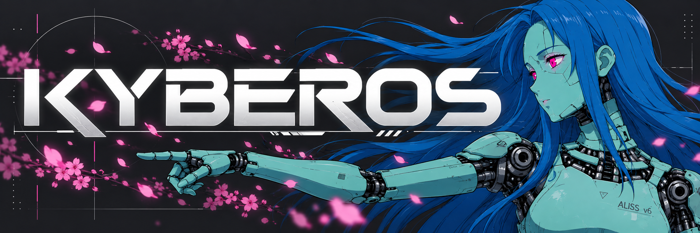

<div align="center">



# Kyberos

### A local-first runtime for persistent, recursive AI agents.

[](https://github.com/triple-threat-dan/Kyberos/actions/workflows/tests.yaml)


</div>

---

**Kyberos** is a lightweight, local-first AI agent runtime designed for building persistent autonomous agents that can reason recursively, retain long-term context, create and use their own skills, and interact across multiple external systems.

At its core, Kyberos implements a **Recursive Language Model (RLM)** architecture. Complex tasks can be delegated to isolated sub-agents, allowing the primary agent to preserve a clean context while still performing deep, multi-step work.

Kyberos combines recursive reasoning with durable memory, structured working context, skill execution, session management, scheduled activity, and multi-channel communication.

The result is an agent that behaves less like a stateless chatbot and more like a persistent software system.

---

## Core Concepts

Kyberos organizes agent state and capabilities around a small set of explicit concepts.

### Thread

The **Thread** represents the agent's active working context.

It tracks the current objective, plan, progress, and immediate state required to continue a task without relying entirely on conversational context.

```text
.kyberos/thread/
```

### Archive

The **Archive** is Kyberos' durable memory and knowledge system.

It stores long-term information that should survive individual conversations, sessions, and restarts.

Individual durable memories within the Archive are called **Engrams**.

```text
.kyberos/archive/
```

### Timeline

The **Timeline** records historical events, activity, conversations, tool executions, and other relevant agent state over time.

It provides the agent with historical context without requiring that history to remain permanently loaded into the model's context window.

```text
.kyberos/timeline/
```

### Skills

**Skills** are reusable capabilities available to the agent.

A Skill may contain instructions, scripts, tools, or supporting resources and follows the `SKILL.md` convention used by several modern agent ecosystems.

```text
.kyberos/skills/
```

Kyberos can use existing Skills or create new ones as it encounters new tasks.

### Protocols

**Protocols** connect Kyberos to external communication systems and services.

Examples include:

* Discord
* Telegram
* Slack (Socket Mode)
* GitHub
* HTTP/API integrations
* Future agent-to-agent communication

Protocols provide a consistent abstraction between the core runtime and external systems.

Slack uses a Slack app with Socket Mode enabled. Configure `protocols.slack` in
`.kyberos/kyberos.json` with `enabled`, `bot_token` (`xoxb-...`), and `app_token`
(`xapp-...`, with the `connections:write` scope). Subscribe the bot to `message.im`
and `message.channels` events and grant the scopes needed to read those conversations
and post messages. `allowed_users` and `allowed_channels` can restrict who and where
the bot responds; direct messages remain available when a channel allowlist is set.

### Codex

The **Codex** contains structured knowledge, instructions, policies, and other reference material used by the agent.

Unlike the Thread, which represents active work, the Codex represents relatively stable information the agent may consult when necessary.

### Dream Cycles

**Dream Cycles** consolidate short-term activity into durable knowledge.

During a Dream Cycle, Kyberos can review recent Timeline events, identify meaningful information, produce Engrams, remove redundant context, and reorganize its Archive.

This allows long-running agents to retain useful information without allowing their memory systems to grow without structure.

---

## Features

### Recursive Reasoning

Kyberos can delegate complex work to isolated sub-agents.

A sub-agent receives the context necessary for its task, performs the work independently, and returns a condensed result to the parent agent.

This allows deep recursive workflows without continuously expanding the primary context window.

### Persistent Memory

Kyberos maintains durable state outside the language model.

Memory remains:

* inspectable
* editable
* searchable
* persistent across restarts
* independent of any specific model provider

Semantic retrieval is supported through a local vector store.

### Skill System

Kyberos supports reusable `SKILL.md`-based capabilities.

Skills can include:

* instructions
* Python scripts
* shell scripts
* supporting files
* structured parameters

### Sandboxed Execution

Kyberos provides controlled execution environments for agent-generated code and tools.

Platform-specific command tools are exposed appropriately:

```text
Windows      → PowerShell
Linux/macOS  → Bash
```

### Multi-Provider LLM Support

Kyberos uses LiteLLM to support multiple model providers behind a common interface.

Providers can include:

* OpenAI
* Anthropic
* Google Gemini
* OpenRouter
* Amazon Bedrock
* local models
* Ollama

### Protocol Adapters

Kyberos can operate across external communication channels while maintaining centralized agent state and session routing.

### Heartbeat

The Heartbeat system allows the agent to periodically evaluate scheduled or recurring tasks without requiring an active user conversation.

### Session Management

Kyberos maintains independent conversational sessions while allowing appropriate shared state to persist through the Archive and Timeline.

### System Logging

Agent activity can be recorded for observability and debugging, including:

* LLM requests
* agent responses
* tool calls
* protocol events
* session activity
* runtime events

---

## Architecture

```text
                     ┌────────────────────┐
                     │       User         │
                     └─────────┬──────────┘
                               │
                         Protocols
                               │
                     ┌─────────▼──────────┐
                     │      Kyberos       │
                     │      Runtime       │
                     └─────────┬──────────┘
                               │
              ┌────────────────┼────────────────┐
              │                │                │
              ▼                ▼                ▼
           Thread           Archive          Timeline
                                │
                              Engrams
              │
              ▼
        Recursive Agent
              │
       ┌──────┴───────┐
       │              │
       ▼              ▼
    Skills        Sub-Agents
       │
       ▼
    Sandbox
```

---

## Installation

Kyberos requires **Python 3.12+** and is designed to run on:

* Windows
* Linux
* WSL2
* macOS

Clone the repository:

```bash
git clone https://github.com/triple-threat-dan/Kyberos.git
cd Kyberos
```

Install dependencies with `uv`:

```bash
uv sync --all-extras --dev
```

Run the test suite:

```bash
uv run pytest
```

---

## Quick Start

Start the Kyberos runtime:

```bash
kyberos start
```

Check its status:

```bash
kyberos status
```

Send a message:

```bash
kyberos message "Hello."
```

Restart the runtime:

```bash
kyberos restart
```

Stop Kyberos:

```bash
kyberos stop
```

---

## Configuration

Kyberos stores local runtime state under:

```text
.kyberos/
```

Configuration is stored in:

```text
.kyberos/kyberos.json
```

Example:

```json
{
  "provider": {
    "name": "openai",
    "model": "gpt-5"
  },
  "safety": {
    "human_confirmation_required": [
      "destructive_file_operations",
      "privileged_commands"
    ]
  }
}
```

Configuration can be opened from the CLI:

```bash
kyberos config
```

### Amazon Bedrock

Bedrock is optional. Install its AWS SDK dependency with `uv sync --extra bedrock` (include `--dev` when setting up for development). In `.kyberos/kyberos.json`, set a model tier's provider to `bedrock` and use a LiteLLM Bedrock model ID, such as `bedrock/amazon.nova-pro-v1:0` or `bedrock/anthropic.claude-3-5-sonnet-20240620-v1:0`:

```json
{
  "agents": {
    "models": {
      "smart_model": {
        "provider": "bedrock",
        "model": "bedrock/amazon.nova-pro-v1:0",
        "enabled": true
      }
    }
  },
  "keys": {
    "bedrock_access_key_id": "YOUR_AWS_ACCESS_KEY_ID",
    "bedrock_secret_access_key": "YOUR_AWS_SECRET_ACCESS_KEY",
    "bedrock_session_token": "YOUR_AWS_SESSION_TOKEN",
    "bedrock_region": "us-east-1"
  }
}
```

For long-term IAM credentials, omit `bedrock_session_token`. Alternatively, set `keys.bedrock` to an Amazon Bedrock API key, or omit Bedrock credentials to use the standard AWS SDK credential chain. Set the AWS region in `bedrock_region` when using explicit credentials.

### TypeSafe JEV decisions

Heartbeat actionability checks use TypeSafe AI's JEV decision model. Set `keys.typesafe` in `.kyberos/kyberos.json` to your TypeSafe API key. The `agents.models.decision_model` tier defaults to provider `typesafe` and model `jev-latest`; existing configs gain this tier when loaded. If JEV is unavailable or the key is missing, the heartbeat check assumes the content is actionable.

The same decision tier routes tools on each reasoning turn. JEV selects from memory, files, shell, skills, and protocol categories using the request and recent turn results. A separate `needs_recursion` answer controls whether `spawn_sub_agent` is offered, subject to the recursion depth limit. Only selected tool schemas are sent to the LLM. If the key is missing or routing fails, other available tools remain visible, while recursion is omitted.

The Dream Cycle classifies daily log chunks as memory, user, heartbeat, or noise before smart-model extraction. Noise is omitted from the extraction prompt; an all-noise log skips that call. Chunks are retained if JEV fails, and a missing key keeps the original log path. Optional dream stories still use the full daily log.

Session summarization also asks JEV whether the recent conversation contains an outcome, decision, or important context for the daily episodic log. A no answer skips the summarizing LLM call. If triage is unavailable, summarization proceeds as before.

---

## Runtime State

A Kyberos installation may contain structures similar to:

```text
.kyberos/
├── archive/
│   └── engrams/
├── thread/
├── timeline/
├── skills/
├── codex/
├── chroma_db/
├── logs/
└── kyberos.json
```

The exact storage layout may evolve as Kyberos v2 develops, while the conceptual boundaries between these systems remain stable.

---

## Development

Install development dependencies:

```bash
uv sync --all-extras --dev
```

Run tests:

```bash
uv run pytest
```

Run tests with coverage:

```bash
uv run pytest --cov=kyberos tests/
```

Build the package:

```bash
uv build
```

---

## Project Status

Kyberos is currently undergoing its **v2 architecture and identity transition** from the original OpenAuric project. I forked it from that project because, while the warlock theme was novel, it didn't feel like it fit anymore.

The v2 effort focuses on:

* a cleaner runtime architecture
* stronger separation between agent subsystems
* improved memory lifecycle management
* better session isolation
* standardized Skills
* extensible Protocols
* improved observability
* safer tool execution
* stronger human-in-the-loop controls
* efficient recursive agent orchestration

OpenAuric's Git history has been preserved as the foundation of Kyberos.

---

## Roadmap

* [DONE] Complete OpenAuric → Kyberos v2 migration
* [ ] Implement Timeline-backed historical context
* [ ] Standardize the Skills subsystem
* [ ] Standardize external integrations as Protocols
* [ ] Improve session lifecycle management
* [ ] Expand Dream Cycle memory consolidation
* [ ] Add agent-to-agent communication
* [ ] Improve local-model and Ollama support
* [ ] Expand human-in-the-loop safety controls
* [ ] Add voice and embodied-agent interfaces

---

## Contributing

Contributions are welcome.

See [`CONTRIBUTING.md`](CONTRIBUTING.md) for development setup, testing requirements, and contribution guidelines.

---

## License

Kyberos is distributed under the **MIT License**.

See [`LICENSE`](LICENSE) for details.
